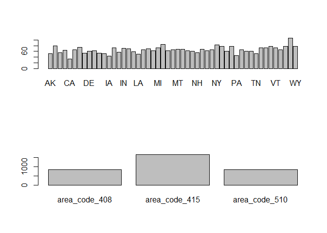
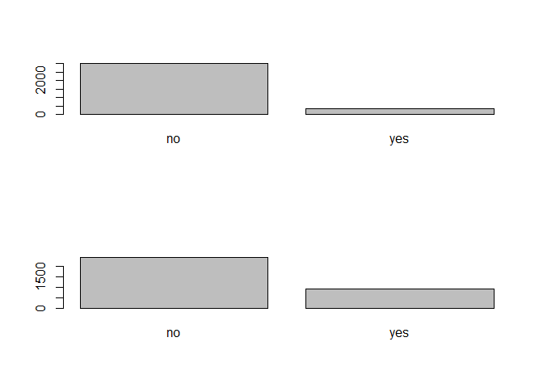
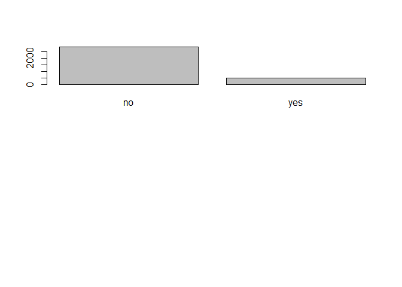

**Install Required Packages**

``` r
#if(!require("pacman")) install.packages("pacman")
pacman::p_load(ggplot2,dplyr,leaps,caret,mlr,rpart)
```

``` r
data_train<-read.csv("Telecom_Train.csv")#read training data
data_test<-read.csv("Telecom_Test.csv")
data_train<-data_train[,-1]
data_test<-data_test[,-1]
sapply(data_train,function(x)sum(is.na(x)))#check for missing values
```

    ##                         state                account_length 
    ##                             0                             0 
    ##                     area_code            international_plan 
    ##                             0                             0 
    ##               voice_mail_plan         number_vmail_messages 
    ##                             0                             0 
    ##             total_day_minutes               total_day_calls 
    ##                             0                             0 
    ##              total_day_charge             total_eve_minutes 
    ##                             0                             0 
    ##               total_eve_calls              total_eve_charge 
    ##                             0                             0 
    ##           total_night_minutes             total_night_calls 
    ##                             0                             0 
    ##            total_night_charge            total_intl_minutes 
    ##                             0                             0 
    ##              total_intl_calls             total_intl_charge 
    ##                             0                             0 
    ## number_customer_service_calls                         churn 
    ##                             0                             0

**EDA**

``` r
str(data_train)
```

    ## 'data.frame':    3333 obs. of  20 variables:
    ##  $ state                        : Factor w/ 51 levels "AK","AL","AR",..: 17 36 32 36 37 2 20 25 19 50 ...
    ##  $ account_length               : int  128 107 137 84 75 118 121 147 117 141 ...
    ##  $ area_code                    : Factor w/ 3 levels "area_code_408",..: 2 2 2 1 2 3 3 2 1 2 ...
    ##  $ international_plan           : Factor w/ 2 levels "no","yes": 1 1 1 2 2 2 1 2 1 2 ...
    ##  $ voice_mail_plan              : Factor w/ 2 levels "no","yes": 2 2 1 1 1 1 2 1 1 2 ...
    ##  $ number_vmail_messages        : int  25 26 0 0 0 0 24 0 0 37 ...
    ##  $ total_day_minutes            : num  265 162 243 299 167 ...
    ##  $ total_day_calls              : int  110 123 114 71 113 98 88 79 97 84 ...
    ##  $ total_day_charge             : num  45.1 27.5 41.4 50.9 28.3 ...
    ##  $ total_eve_minutes            : num  197.4 195.5 121.2 61.9 148.3 ...
    ##  $ total_eve_calls              : int  99 103 110 88 122 101 108 94 80 111 ...
    ##  $ total_eve_charge             : num  16.78 16.62 10.3 5.26 12.61 ...
    ##  $ total_night_minutes          : num  245 254 163 197 187 ...
    ##  $ total_night_calls            : int  91 103 104 89 121 118 118 96 90 97 ...
    ##  $ total_night_charge           : num  11.01 11.45 7.32 8.86 8.41 ...
    ##  $ total_intl_minutes           : num  10 13.7 12.2 6.6 10.1 6.3 7.5 7.1 8.7 11.2 ...
    ##  $ total_intl_calls             : int  3 3 5 7 3 6 7 6 4 5 ...
    ##  $ total_intl_charge            : num  2.7 3.7 3.29 1.78 2.73 1.7 2.03 1.92 2.35 3.02 ...
    ##  $ number_customer_service_calls: int  1 1 0 2 3 0 3 0 1 0 ...
    ##  $ churn                        : Factor w/ 2 levels "no","yes": 1 1 1 1 1 1 1 1 1 1 ...

``` r
datanum<-data_train[,c(2,6:19)]
summary(datanum)
```

    ##  account_length  number_vmail_messages total_day_minutes total_day_calls
    ##  Min.   :  1.0   Min.   : 0.000        Min.   :  0.0     Min.   :  0.0  
    ##  1st Qu.: 74.0   1st Qu.: 0.000        1st Qu.:143.7     1st Qu.: 87.0  
    ##  Median :101.0   Median : 0.000        Median :179.4     Median :101.0  
    ##  Mean   :101.1   Mean   : 8.099        Mean   :179.8     Mean   :100.4  
    ##  3rd Qu.:127.0   3rd Qu.:20.000        3rd Qu.:216.4     3rd Qu.:114.0  
    ##  Max.   :243.0   Max.   :51.000        Max.   :350.8     Max.   :165.0  
    ##  total_day_charge total_eve_minutes total_eve_calls total_eve_charge
    ##  Min.   : 0.00    Min.   :  0.0     Min.   :  0.0   Min.   : 0.00   
    ##  1st Qu.:24.43    1st Qu.:166.6     1st Qu.: 87.0   1st Qu.:14.16   
    ##  Median :30.50    Median :201.4     Median :100.0   Median :17.12   
    ##  Mean   :30.56    Mean   :201.0     Mean   :100.1   Mean   :17.08   
    ##  3rd Qu.:36.79    3rd Qu.:235.3     3rd Qu.:114.0   3rd Qu.:20.00   
    ##  Max.   :59.64    Max.   :363.7     Max.   :170.0   Max.   :30.91   
    ##  total_night_minutes total_night_calls total_night_charge total_intl_minutes
    ##  Min.   : 23.2       Min.   : 33.0     Min.   : 1.040     Min.   : 0.00     
    ##  1st Qu.:167.0       1st Qu.: 87.0     1st Qu.: 7.520     1st Qu.: 8.50     
    ##  Median :201.2       Median :100.0     Median : 9.050     Median :10.30     
    ##  Mean   :200.9       Mean   :100.1     Mean   : 9.039     Mean   :10.24     
    ##  3rd Qu.:235.3       3rd Qu.:113.0     3rd Qu.:10.590     3rd Qu.:12.10     
    ##  Max.   :395.0       Max.   :175.0     Max.   :17.770     Max.   :20.00     
    ##  total_intl_calls total_intl_charge number_customer_service_calls
    ##  Min.   : 0.000   Min.   :0.000     Min.   :0.000                
    ##  1st Qu.: 3.000   1st Qu.:2.300     1st Qu.:1.000                
    ##  Median : 4.000   Median :2.780     Median :1.000                
    ##  Mean   : 4.479   Mean   :2.765     Mean   :1.563                
    ##  3rd Qu.: 6.000   3rd Qu.:3.270     3rd Qu.:2.000                
    ##  Max.   :20.000   Max.   :5.400     Max.   :9.000

``` r
par(mfrow=c(2,1))
barplot(table(data_train$state))
barplot(table(data_train$area_code))
```

<!-- -->

``` r
barplot(table(data_train$international_plan))
barplot(table(data_train$voice_mail_plan))
```

<!-- -->

``` r
barplot(table(data_train$churn))
```

<!-- -->

**Logistic regression model**

``` r
#RUN 1
fit_glm = glm(churn~.,data=data_train,family=binomial(link = 'logit'))
summary(fit_glm)
```

    ## 
    ## Call:
    ## glm(formula = churn ~ ., family = binomial(link = "logit"), data = data_train)
    ## 
    ## Deviance Residuals: 
    ##     Min       1Q   Median       3Q      Max  
    ## -1.9487  -0.4995  -0.3123  -0.1661   3.0431  
    ## 
    ## Coefficients:
    ##                                 Estimate Std. Error z value Pr(>|z|)    
    ## (Intercept)                   -9.686e+00  9.798e-01  -9.885  < 2e-16 ***
    ## stateAL                        3.385e-01  7.629e-01   0.444 0.657272    
    ## stateAR                        9.106e-01  7.519e-01   1.211 0.225884    
    ## stateAZ                        8.973e-02  8.452e-01   0.106 0.915453    
    ## stateCA                        1.816e+00  7.822e-01   2.322 0.020238 *  
    ## stateCO                        6.445e-01  7.631e-01   0.845 0.398339    
    ## stateCT                        1.021e+00  7.252e-01   1.408 0.159167    
    ## stateDC                        6.880e-01  8.081e-01   0.851 0.394577    
    ## stateDE                        7.460e-01  7.490e-01   0.996 0.319234    
    ## stateFL                        5.916e-01  7.610e-01   0.777 0.436956    
    ## stateGA                        6.601e-01  7.778e-01   0.849 0.396075    
    ## stateHI                       -2.300e-01  8.963e-01  -0.257 0.797469    
    ## stateIA                        2.083e-01  9.024e-01   0.231 0.817410    
    ## stateID                        8.705e-01  7.474e-01   1.165 0.244100    
    ## stateIL                       -2.382e-01  8.340e-01  -0.286 0.775165    
    ## stateIN                        4.410e-01  7.526e-01   0.586 0.557924    
    ## stateKS                        1.062e+00  7.296e-01   1.455 0.145659    
    ## stateKY                        7.889e-01  7.658e-01   1.030 0.302931    
    ## stateLA                        5.546e-01  8.352e-01   0.664 0.506716    
    ## stateMA                        1.161e+00  7.430e-01   1.562 0.118261    
    ## stateMD                        1.144e+00  7.168e-01   1.596 0.110430    
    ## stateME                        1.327e+00  7.281e-01   1.823 0.068321 .  
    ## stateMI                        1.390e+00  7.137e-01   1.948 0.051400 .  
    ## stateMN                        1.160e+00  7.149e-01   1.622 0.104709    
    ## stateMO                        5.979e-01  7.741e-01   0.772 0.439914    
    ## stateMS                        1.355e+00  7.278e-01   1.862 0.062601 .  
    ## stateMT                        1.865e+00  7.166e-01   2.603 0.009245 ** 
    ## stateNC                        5.765e-01  7.545e-01   0.764 0.444822    
    ## stateND                        1.274e-01  7.969e-01   0.160 0.872995    
    ## stateNE                        2.952e-01  8.055e-01   0.367 0.713984    
    ## stateNH                        1.160e+00  7.689e-01   1.509 0.131367    
    ## stateNJ                        1.572e+00  7.098e-01   2.215 0.026757 *  
    ## stateNM                        4.590e-01  7.867e-01   0.583 0.559596    
    ## stateNV                        1.251e+00  7.245e-01   1.727 0.084198 .  
    ## stateNY                        1.161e+00  7.191e-01   1.614 0.106496    
    ## stateOH                        6.726e-01  7.464e-01   0.901 0.367508    
    ## stateOK                        8.660e-01  7.557e-01   1.146 0.251811    
    ## stateOR                        7.684e-01  7.354e-01   1.045 0.296126    
    ## statePA                        1.141e+00  7.791e-01   1.464 0.143121    
    ## stateRI                       -1.099e-01  8.198e-01  -0.134 0.893337    
    ## stateSC                        1.747e+00  7.371e-01   2.370 0.017782 *  
    ## stateSD                        8.227e-01  7.607e-01   1.081 0.279510    
    ## stateTN                        2.604e-01  8.207e-01   0.317 0.751071    
    ## stateTX                        1.637e+00  7.079e-01   2.313 0.020745 *  
    ## stateUT                        1.047e+00  7.435e-01   1.408 0.159056    
    ## stateVA                       -4.425e-01  8.220e-01  -0.538 0.590344    
    ## stateVT                        8.390e-02  7.799e-01   0.108 0.914330    
    ## stateWA                        1.400e+00  7.237e-01   1.934 0.053081 .  
    ## stateWI                        2.836e-01  7.798e-01   0.364 0.716109    
    ## stateWV                        5.732e-01  7.329e-01   0.782 0.434139    
    ## stateWY                        2.952e-01  7.541e-01   0.391 0.695449    
    ## account_length                 9.646e-04  1.434e-03   0.673 0.501212    
    ## area_codearea_code_415        -7.876e-02  1.418e-01  -0.555 0.578569    
    ## area_codearea_code_510        -1.016e-01  1.632e-01  -0.622 0.533622    
    ## international_planyes          2.192e+00  1.534e-01  14.294  < 2e-16 ***
    ## voice_mail_planyes            -2.131e+00  5.944e-01  -3.585 0.000337 ***
    ## number_vmail_messages          3.832e-02  1.865e-02   2.055 0.039866 *  
    ## total_day_minutes             -3.823e-01  3.380e+00  -0.113 0.909942    
    ## total_day_calls                4.045e-03  2.862e-03   1.414 0.157477    
    ## total_day_charge               2.326e+00  1.988e+01   0.117 0.906870    
    ## total_eve_minutes              8.927e-01  1.700e+00   0.525 0.599510    
    ## total_eve_calls                1.018e-03  2.890e-03   0.352 0.724642    
    ## total_eve_charge              -1.041e+01  2.000e+01  -0.521 0.602695    
    ## total_night_minutes           -2.228e-01  9.044e-01  -0.246 0.805401    
    ## total_night_calls              1.810e-04  2.928e-03   0.062 0.950718    
    ## total_night_charge             5.039e+00  2.010e+01   0.251 0.802042    
    ## total_intl_minutes            -4.149e+00  5.494e+00  -0.755 0.450194    
    ## total_intl_calls              -9.055e-02  2.575e-02  -3.516 0.000438 ***
    ## total_intl_charge              1.567e+01  2.035e+01   0.770 0.441115    
    ## number_customer_service_calls  5.366e-01  4.100e-02  13.089  < 2e-16 ***
    ## ---
    ## Signif. codes:  0 '***' 0.001 '**' 0.01 '*' 0.05 '.' 0.1 ' ' 1
    ## 
    ## (Dispersion parameter for binomial family taken to be 1)
    ## 
    ##     Null deviance: 2758.3  on 3332  degrees of freedom
    ## Residual deviance: 2070.8  on 3263  degrees of freedom
    ## AIC: 2210.8
    ## 
    ## Number of Fisher Scoring iterations: 6

``` r
data_train$pred =as.factor(ifelse(predict(fit_glm,data_train[,-20],type='response')>0.5,'yes','no'))
confusionMatrix(data_train$churn,data_train$pred)
```

    ## Confusion Matrix and Statistics
    ## 
    ##           Reference
    ## Prediction   no  yes
    ##        no  2760   90
    ##        yes  357  126
    ##                                           
    ##                Accuracy : 0.8659          
    ##                  95% CI : (0.8538, 0.8773)
    ##     No Information Rate : 0.9352          
    ##     P-Value [Acc > NIR] : 1               
    ##                                           
    ##                   Kappa : 0.2976          
    ##                                           
    ##  Mcnemar's Test P-Value : <2e-16          
    ##                                           
    ##             Sensitivity : 0.8855          
    ##             Specificity : 0.5833          
    ##          Pos Pred Value : 0.9684          
    ##          Neg Pred Value : 0.2609          
    ##              Prevalence : 0.9352          
    ##          Detection Rate : 0.8281          
    ##    Detection Prevalence : 0.8551          
    ##       Balanced Accuracy : 0.7344          
    ##                                           
    ##        'Positive' Class : no              
    ## 

``` r
data_test$pred = as.factor(ifelse(predict(fit_glm,
                                  data_test[,-20],
                                  type = 'response')>0.5,'yes','no'))
confusionMatrix(data_test$churn,data_test$pred)
```

    ## Confusion Matrix and Statistics
    ## 
    ##           Reference
    ## Prediction   no  yes
    ##        no  1395   48
    ##        yes  170   54
    ##                                           
    ##                Accuracy : 0.8692          
    ##                  95% CI : (0.8521, 0.8851)
    ##     No Information Rate : 0.9388          
    ##     P-Value [Acc > NIR] : 1               
    ##                                           
    ##                   Kappa : 0.2699          
    ##                                           
    ##  Mcnemar's Test P-Value : 2.503e-16       
    ##                                           
    ##             Sensitivity : 0.8914          
    ##             Specificity : 0.5294          
    ##          Pos Pred Value : 0.9667          
    ##          Neg Pred Value : 0.2411          
    ##              Prevalence : 0.9388          
    ##          Detection Rate : 0.8368          
    ##    Detection Prevalence : 0.8656          
    ##       Balanced Accuracy : 0.7104          
    ##                                           
    ##        'Positive' Class : no              
    ## 

``` r
# the split of probability should be in confirmity with the 
# train dataset
(table(data_train$churn)/nrow(data_train)*100)
```

    ## 
    ##       no      yes 
    ## 85.50855 14.49145

``` r
(table(data_train$pred)/nrow(data_train)*100)
```

    ## 
    ##        no       yes 
    ## 93.519352  6.480648

``` r
(table(data_test$churn)/nrow(data_test)*100)
```

    ## 
    ##       no      yes 
    ## 86.56269 13.43731

``` r
(table(data_test$pred)/nrow(data_test)*100)
```

    ## 
    ##        no       yes 
    ## 93.881224  6.118776

kappa statistics is used to measure the magnitude of agreement between
two observers.It accounts for possibility of agreement accuring by
chance by removing it from total agreement.

Though the accuracy of the above model is 86%,Kappa statistics with
threshold 0.5 is very low.If we change the threshold probability,that
might give us better kappa statistic.

``` r
#RUN 2
data_train$pred =as.factor(ifelse(predict(fit_glm,data_train[,-c(20,21)],type='response')>0.6,'yes','no'))
confusionMatrix(data_train$churn,data_train$pred)
```

    ## Confusion Matrix and Statistics
    ## 
    ##           Reference
    ## Prediction   no  yes
    ##        no  2808   42
    ##        yes  406   77
    ##                                          
    ##                Accuracy : 0.8656         
    ##                  95% CI : (0.8535, 0.877)
    ##     No Information Rate : 0.9643         
    ##     P-Value [Acc > NIR] : 1              
    ##                                          
    ##                   Kappa : 0.2106         
    ##                                          
    ##  Mcnemar's Test P-Value : <2e-16         
    ##                                          
    ##             Sensitivity : 0.8737         
    ##             Specificity : 0.6471         
    ##          Pos Pred Value : 0.9853         
    ##          Neg Pred Value : 0.1594         
    ##              Prevalence : 0.9643         
    ##          Detection Rate : 0.8425         
    ##    Detection Prevalence : 0.8551         
    ##       Balanced Accuracy : 0.7604         
    ##                                          
    ##        'Positive' Class : no             
    ## 

``` r
data_test$pred = as.factor(ifelse(predict(fit_glm,
                                  data_test[,-c(20,21)],
                                  type = 'response')>0.6,'yes','no'))
confusionMatrix(data_test$churn,data_test$pred)
```

    ## Confusion Matrix and Statistics
    ## 
    ##           Reference
    ## Prediction   no  yes
    ##        no  1418   25
    ##        yes  186   38
    ##                                          
    ##                Accuracy : 0.8734         
    ##                  95% CI : (0.8565, 0.889)
    ##     No Information Rate : 0.9622         
    ##     P-Value [Acc > NIR] : 1              
    ##                                          
    ##                   Kappa : 0.2187         
    ##                                          
    ##  Mcnemar's Test P-Value : <2e-16         
    ##                                          
    ##             Sensitivity : 0.8840         
    ##             Specificity : 0.6032         
    ##          Pos Pred Value : 0.9827         
    ##          Neg Pred Value : 0.1696         
    ##              Prevalence : 0.9622         
    ##          Detection Rate : 0.8506         
    ##    Detection Prevalence : 0.8656         
    ##       Balanced Accuracy : 0.7436         
    ##                                          
    ##        'Positive' Class : no             
    ## 

``` r
# the split of probability should be in confirmity with the 
# train dataset
(table(data_train$churn)/nrow(data_train)*100)
```

    ## 
    ##       no      yes 
    ## 85.50855 14.49145

``` r
(table(data_train$pred)/nrow(data_train)*100)
```

    ## 
    ##        no       yes 
    ## 96.429643  3.570357

``` r
(table(data_test$churn)/nrow(data_test)*100)
```

    ## 
    ##       no      yes 
    ## 86.56269 13.43731

``` r
(table(data_test$pred)/nrow(data_test)*100)
```

    ## 
    ##        no       yes 
    ## 96.220756  3.779244

``` r
data_train$pred =as.factor(ifelse(predict(fit_glm,data_train[,-c(20,21)],type='response')>0.4,'yes','no'))
confusionMatrix(data_train$churn,data_train$pred)
```

    ## Confusion Matrix and Statistics
    ## 
    ##           Reference
    ## Prediction   no  yes
    ##        no  2702  148
    ##        yes  293  190
    ##                                          
    ##                Accuracy : 0.8677         
    ##                  95% CI : (0.8557, 0.879)
    ##     No Information Rate : 0.8986         
    ##     P-Value [Acc > NIR] : 1              
    ##                                          
    ##                   Kappa : 0.3901         
    ##                                          
    ##  Mcnemar's Test P-Value : 7.025e-12      
    ##                                          
    ##             Sensitivity : 0.9022         
    ##             Specificity : 0.5621         
    ##          Pos Pred Value : 0.9481         
    ##          Neg Pred Value : 0.3934         
    ##              Prevalence : 0.8986         
    ##          Detection Rate : 0.8107         
    ##    Detection Prevalence : 0.8551         
    ##       Balanced Accuracy : 0.7322         
    ##                                          
    ##        'Positive' Class : no             
    ## 

``` r
data_test$pred = as.factor(ifelse(predict(fit_glm,
                                  data_test[,-c(20,21)],
                                  type = 'response')>0.4,'yes','no'))
confusionMatrix(data_test$churn,data_test$pred)
```

    ## Confusion Matrix and Statistics
    ## 
    ##           Reference
    ## Prediction   no  yes
    ##        no  1365   78
    ##        yes  143   81
    ##                                           
    ##                Accuracy : 0.8674          
    ##                  95% CI : (0.8502, 0.8833)
    ##     No Information Rate : 0.9046          
    ##     P-Value [Acc > NIR] : 1               
    ##                                           
    ##                   Kappa : 0.3505          
    ##                                           
    ##  Mcnemar's Test P-Value : 1.669e-05       
    ##                                           
    ##             Sensitivity : 0.9052          
    ##             Specificity : 0.5094          
    ##          Pos Pred Value : 0.9459          
    ##          Neg Pred Value : 0.3616          
    ##              Prevalence : 0.9046          
    ##          Detection Rate : 0.8188          
    ##    Detection Prevalence : 0.8656          
    ##       Balanced Accuracy : 0.7073          
    ##                                           
    ##        'Positive' Class : no              
    ## 

``` r
# the split of probability should be in confirmity with the 
# train dataset
(table(data_train$churn)/nrow(data_train)*100)
```

    ## 
    ##       no      yes 
    ## 85.50855 14.49145

``` r
(table(data_train$pred)/nrow(data_train)*100)
```

    ## 
    ##       no      yes 
    ## 89.85899 10.14101

``` r
(table(data_test$churn)/nrow(data_test)*100)
```

    ## 
    ##       no      yes 
    ## 86.56269 13.43731

``` r
(table(data_test$pred)/nrow(data_test)*100)
```

    ## 
    ##        no       yes 
    ## 90.461908  9.538092

``` r
data_train$pred =as.factor(ifelse(predict(fit_glm,data_train[,-c(20,21)],type='response')>0.3,'yes','no'))
confusionMatrix(data_train$churn,data_train$pred)
```

    ## Confusion Matrix and Statistics
    ## 
    ##           Reference
    ## Prediction   no  yes
    ##        no  2612  238
    ##        yes  230  253
    ##                                           
    ##                Accuracy : 0.8596          
    ##                  95% CI : (0.8473, 0.8712)
    ##     No Information Rate : 0.8527          
    ##     P-Value [Acc > NIR] : 0.1355          
    ##                                           
    ##                   Kappa : 0.4373          
    ##                                           
    ##  Mcnemar's Test P-Value : 0.7463          
    ##                                           
    ##             Sensitivity : 0.9191          
    ##             Specificity : 0.5153          
    ##          Pos Pred Value : 0.9165          
    ##          Neg Pred Value : 0.5238          
    ##              Prevalence : 0.8527          
    ##          Detection Rate : 0.7837          
    ##    Detection Prevalence : 0.8551          
    ##       Balanced Accuracy : 0.7172          
    ##                                           
    ##        'Positive' Class : no              
    ## 

``` r
data_test$pred = as.factor(ifelse(predict(fit_glm,
                                  data_test[,-c(20,21)],
                                  type = 'response')>0.3,'yes','no'))
cm=confusionMatrix(data_test$churn,data_test$pred)
```

``` r
# the split of probability should be in confirmity with the 
# train dataset
(table(data_train$churn)/nrow(data_train)*100)
```

    ## 
    ##       no      yes 
    ## 85.50855 14.49145

``` r
(table(data_train$pred)/nrow(data_train)*100)
```

    ## 
    ##       no      yes 
    ## 85.26853 14.73147

``` r
(table(data_test$churn)/nrow(data_test)*100)
```

    ## 
    ##       no      yes 
    ## 86.56269 13.43731

``` r
(table(data_test$pred)/nrow(data_test)*100)
```

    ## 
    ##      no     yes 
    ## 85.4829 14.5171

From kappa statistics we can see the model with probality threshold
ratio 0.3 is most reliable.

**Decision tress with cross validation**

``` r
data_train<-data_train[,-21]
data_test<-data_test[,-21]
train_control<-trainControl(method = "cv", number = 10)
metric<-'Accuracy'
# Decision tree based methods
fit_dt <- caret::train(churn~.,data=data_train,trControl=train_control,method='rpart')

fit_dt
```

    ## CART 
    ## 
    ## 3333 samples
    ##   19 predictor
    ##    2 classes: 'no', 'yes' 
    ## 
    ## No pre-processing
    ## Resampling: Cross-Validated (10 fold) 
    ## Summary of sample sizes: 2999, 3000, 3000, 2999, 3000, 3000, ... 
    ## Resampling results across tuning parameters:
    ## 
    ##   cp          Accuracy   Kappa    
    ##   0.07867495  0.8811836  0.3680926
    ##   0.08488613  0.8670919  0.2463349
    ##   0.08902692  0.8610859  0.1919870
    ## 
    ## Accuracy was used to select the optimal model using the largest value.
    ## The final value used for the model was cp = 0.07867495.

``` r
predictions <- predict(fit_dt,data_test[,-20])
pred = cbind(data_test,predictions)
confusionMatrix(pred$churn,pred$predictions)
```

    ## Confusion Matrix and Statistics
    ## 
    ##           Reference
    ## Prediction   no  yes
    ##        no  1419   24
    ##        yes  164   60
    ##                                          
    ##                Accuracy : 0.8872         
    ##                  95% CI : (0.8711, 0.902)
    ##     No Information Rate : 0.9496         
    ##     P-Value [Acc > NIR] : 1              
    ##                                          
    ##                   Kappa : 0.3413         
    ##                                          
    ##  Mcnemar's Test P-Value : <2e-16         
    ##                                          
    ##             Sensitivity : 0.8964         
    ##             Specificity : 0.7143         
    ##          Pos Pred Value : 0.9834         
    ##          Neg Pred Value : 0.2679         
    ##              Prevalence : 0.9496         
    ##          Detection Rate : 0.8512         
    ##    Detection Prevalence : 0.8656         
    ##       Balanced Accuracy : 0.8053         
    ##                                          
    ##        'Positive' Class : no             
    ## 

``` r
sd(fit_dt$resample$Accuracy)
```

    ## [1] 0.0138304

Decision tree model with cp = 0.078 gives the best test accuracy of 88%.
Standard deviation of accuracy across cross validation samples is
0.014.Kappa statistic 0.34.

**C5.0**

``` r
fit_dt <- caret::train(churn~.,data=data_train,trControl=train_control,
                       method='C5.0')

fit_dt
```

    ## C5.0 
    ## 
    ## 3333 samples
    ##   19 predictor
    ##    2 classes: 'no', 'yes' 
    ## 
    ## No pre-processing
    ## Resampling: Cross-Validated (10 fold) 
    ## Summary of sample sizes: 3000, 2999, 3000, 3000, 2999, 3000, ... 
    ## Resampling results across tuning parameters:
    ## 
    ##   model  winnow  trials  Accuracy   Kappa    
    ##   rules  FALSE    1      0.9417975  0.7443189
    ##   rules  FALSE   10      0.9547005  0.8013335
    ##   rules  FALSE   20      0.9582996  0.8167251
    ##   rules   TRUE    1      0.9420987  0.7476368
    ##   rules   TRUE   10      0.9523017  0.7947559
    ##   rules   TRUE   20      0.9562020  0.8095400
    ##   tree   FALSE    1      0.9448050  0.7578538
    ##   tree   FALSE   10      0.9492978  0.7730321
    ##   tree   FALSE   20      0.9525975  0.7896953
    ##   tree    TRUE    1      0.9418047  0.7463012
    ##   tree    TRUE   10      0.9519987  0.7895851
    ##   tree    TRUE   20      0.9553002  0.8046733
    ## 
    ## Accuracy was used to select the optimal model using the largest value.
    ## The final values used for the model were trials = 20, model = rules and
    ##  winnow = FALSE.

``` r
predictions <- predict(fit_dt,data_test[,-20])
pred = cbind(data_test,predictions)
confusionMatrix(pred$churn,pred$predictions)
```

    ## Confusion Matrix and Statistics
    ## 
    ##           Reference
    ## Prediction   no  yes
    ##        no  1436    7
    ##        yes   58  166
    ##                                           
    ##                Accuracy : 0.961           
    ##                  95% CI : (0.9506, 0.9698)
    ##     No Information Rate : 0.8962          
    ##     P-Value [Acc > NIR] : < 2.2e-16       
    ##                                           
    ##                   Kappa : 0.8146          
    ##                                           
    ##  Mcnemar's Test P-Value : 5.584e-10       
    ##                                           
    ##             Sensitivity : 0.9612          
    ##             Specificity : 0.9595          
    ##          Pos Pred Value : 0.9951          
    ##          Neg Pred Value : 0.7411          
    ##              Prevalence : 0.8962          
    ##          Detection Rate : 0.8614          
    ##    Detection Prevalence : 0.8656          
    ##       Balanced Accuracy : 0.9604          
    ##                                           
    ##        'Positive' Class : no              
    ## 

``` r
sd(fit_dt$resample$Accuracy)
```

    ## [1] 0.01079571

C5.0 model gives best test accuracy of 95%. Standard deviation of
accuracy across cross validation samples is 0.0085.Kappa statistic is
0.812.

**XgbTree**

``` r
fit_dt <- caret::train(churn~.,data=data_train,trControl=train_control,method='xgbTree')

predictions <- predict(fit_dt,data_test[,-20])
pred = cbind(data_test,predictions)
confusionMatrix(pred$churn,pred$predictions)
```

    ## Confusion Matrix and Statistics
    ## 
    ##           Reference
    ## Prediction   no  yes
    ##        no  1430   13
    ##        yes   72  152
    ##                                           
    ##                Accuracy : 0.949           
    ##                  95% CI : (0.9373, 0.9591)
    ##     No Information Rate : 0.901           
    ##     P-Value [Acc > NIR] : 5.842e-13       
    ##                                           
    ##                   Kappa : 0.7534          
    ##                                           
    ##  Mcnemar's Test P-Value : 3.155e-10       
    ##                                           
    ##             Sensitivity : 0.9521          
    ##             Specificity : 0.9212          
    ##          Pos Pred Value : 0.9910          
    ##          Neg Pred Value : 0.6786          
    ##              Prevalence : 0.9010          
    ##          Detection Rate : 0.8578          
    ##    Detection Prevalence : 0.8656          
    ##       Balanced Accuracy : 0.9366          
    ##                                           
    ##        'Positive' Class : no              
    ## 

``` r
sd(fit_dt$resample$Accuracy)
```

    ## [1] 0.008275496

Xgboost tree model gives best test accuracy of 95%. Standard deviation
of accuracy across cross-validation samples is 0.01.Kappa statistic is
0.77.

We will select C5.0 model as final prediction model as it has the
highest accuracy and kappa statistic as well as the least standard
deviation across cross-validation sample indicating low variance.
